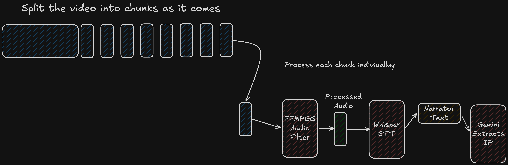
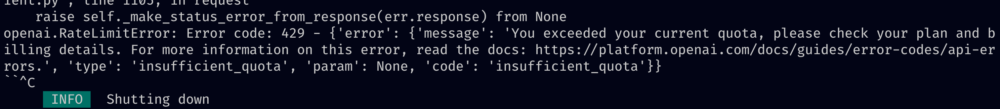

+++
date = '2026-05-22T17:09:14+01:00'
draft = false
title = 'Detecting Important Moments in a Football Match'
summary = "How three CS students built a real-time football match analyzer that detects important moments and switches between two live screens using Whisper STT, Gemini 2.5 Flash, and HLS streaming."
author = "Blagoy Simandoff"
tags = ["Project", "Engineering", "AI", "Python", "Hackathon"]

[cover]
image = "images/cover-tug-blog.png"
relative = true
+++

Picking a hackathon idea is harder than it sounds, especially when you're trying
to challenge yourself and not build something embarrassing.

Last week me and a few friends
([Mert Milenov](https://www.linkedin.com/in/mert-milenov/) and
[Kris Dimitrov](https://www.linkedin.com/in/kristian-dimitrov-b66718228?originalSubdomain=bg))
from college ([UCC](https://www.ucc.ie/en/)) signed up for the
[ACM World Cup 2026 Hackathon](https://www.instagram.com/p/DXpNQpuDAze/). This
year the theme was _really_ freeing - we were tasked to create something that
relates in any way to the sport of football and/or to the upcoming world cup. We
were looking forward to this hackathon for a few weeks now so we did have some
ideas in store. Quickly after the initial brainstorming session we had chosen
two that were both

1. Challenging enough to be interesting
2. Complemented each other in terms of the implementation (Both shared the same
   base premise for the implementation and differed in the "presentation" of
   that base premise)

That's how our (pretty ambitious) ideas came to life. The first one was a
problem that Kris had experienced while following the latest Premier League -
multiple matches were happening at the same time. Some of which were ones that
Kris wanted to watch. How could he watch them both at the same time, while not
diverting his attention too much from each?

Our solution was a system that would detect the most important and interesting
points from a match and switch between the screens dynamically. When there was a
goal, a fault or a kickoff - anything worth your attention - we would switch to
that screen and put the other match in the corner, still accessible, just
waiting for its moment to shine...


There are a few things happening on the screen. The first is the line at the top
showcasing the important moments we have detected so far for each match with a
timestamp at the end showcasing when the moment happened.


The second is the "Narrator" button at the top right corner which I will explain
in a bit. (We had a TON of trouble with that one :D)

Here is a quick demo video of how the whole thing worked.



# Detecting important moments - The How

So how did we do this? The majority of the first day this two-day hackathon was
spent on researching and trying to find the best way to achieve this with
maximum performance, accuracy, reliability and minimum cost.

The main problem we were trying to solve was how can we, given a football
match - both the video and audio - detect the most important moments?

After some googling and researching we got a few possible solutions:

## Option 1: SoccerNet-v2

[SoccerNet-v2](https://github.com/SilvioGiancola/SoccerNetv2-DevKit) is an open
benchmark and dataset for broadcast soccer understanding, with pre-trained
action spotting models built on top of ResNet-152 features. It covers 17 action
classes across 500 full games. Seemed perfect on paper. In practice, accuracy
was unreliable - it would fire at high confidence on events that weren't there,
and under-detect obvious ones like goals. The bigger problem: it
double-triggered on replays. Broadcast footage replays every notable moment, and
the model had no concept of that - it would spot the same event twice, live and
again on replay, with no way to deduplicate reliably.

## Option 2: External API

We searched for a sports API that was cheap, accurate on historical data, and
detected enough event types to make the screen-switching feel alive. We landed
on [sports.bzzoiro.com](https://sports.bzzoiro.com/). First red flag: the
website looked AI-generated. We bought the API anyway for 3 euros and dove in.
The documentation was either non-existent or flat-out wrong, also almost
certainly AI-generated. Hopefully they fix it at some point.

The real problems surfaced during integration. Historical match coverage was
thin. Matches we wanted to use for the demo were simply missing, forcing us to
hunt for different videos and footage. That wasted a significant chunk of our
already limited time.

The deeper problem, and the reason we ultimately abandoned it: for historical
matches the API only returned a handful of event types. Goals and fouls. Nothing
else. No attacks, no near misses, no highlights. For most matches that means a
handful of events total, so the screen would barely ever switch and the whole
idea fell flat in the demo.

On top of that, all timestamps were in "match time" (minutes into the game)
rather than "video time" (position in the actual video file). We had to hardcode
an offset just to align the two for the demo. Not a dealbreaker on its own, but
one more thing piling up. All of this combined ruled the API out.

## Option 3: Whisper STT + Gemini 2.5 Flash

[Whisper](https://openai.com/research/whisper) +
[Gemini 2.5 Flash](https://deepmind.google/models/gemini/flash/) - the option we
really wanted to avoid. Both the cost of inference and overall LLM fatigue
really repelled us from this at first. We were already certain every other team
would show up with some kind of "AI solution," and we genuinely wanted to avoid
being one of them. But after exhausting the other options, this was all that was
left.

The idea was straightforward. Run the match audio through Whisper (OpenAI's
speech-to-text model) to extract the narrator's commentary as text, then pass
that text to Gemini 2.5 Flash and ask it to return a structured list of
important moments, each with a timestamp and a short description of what
happened. We picked Flash specifically because it is fast, cheap, and well
suited to bulk structured extraction tasks.

The first problem: Whisper couldn't reliably transcribe the narrator because of
the crowd noise. Kris built two ffmpeg audio filter pipelines - one to clean the
audio up for Whisper, and an inverse one (to remove the narrator and only leave
the audience sound) for the custom narrator feature (more on that below). After
a couple of grueling hours he had both working and Whisper's accuracy improved
_significantly_.

_Going into the audio weeds now. If you don't care how Kris pulled this off,
feel free to
[skip ahead](#streaming-the-match-chunking-and-processing-the-video-in-real-time)._

<details>
<summary>Audio filter deep-dive</summary>

**Cleaning up the audio for Whisper**

The goal: keep the commentator, suppress the crowd.

1. **[High-pass filter](https://en.wikipedia.org/wiki/High-pass_filter) (cut
   below 200Hz)** - Crowd noise is dominated by low-frequency energy: bass
   roars, stadium rumble, drums. Human speech sits between roughly 300Hz and
   3kHz. Cutting everything below 200Hz removes a large chunk of crowd energy
   without touching the voice.

2. **[Spectral noise reduction](https://en.wikipedia.org/wiki/Noise_reduction)**

   - Builds a statistical model of what "background noise" looks like across the
     frequency spectrum and subtracts it. What persists consistently across
     frames (crowd hum, ambient rumble) gets attenuated. What varies (speech in
     our case) gets preserved. Of course this is not perfect, but it does a good
     job.

3. **[EQ](<https://en.wikipedia.org/wiki/Equalization_(audio)>) boost at 1kHz
   (+4dB)** - Nudges up the core speech frequency band so Whisper has a
   stronger, cleaner voice signal to work with.

4. **[Dynamic normalization](https://en.wikipedia.org/wiki/Dynamic_range_compression)**
   - Evens out volume swings across the audio. A commentator gets loud on a goal
     and quiet during dull play. Normalizing the audio keeps the level
     consistent so Whisper doesn't miss quiet speech.

**Stripping the commentator for the custom narrator**

For the narrator feature (more on this below) we needed the inverse: crowd
ambience only without the commentator. Kris used a
[stereo center-channel subtraction](<https://en.wikipedia.org/wiki/Panning_(audio)>)
trick. Stereo audio has two channels: Left (L) and Right (R). TV broadcasts
always pan the commentator dead center, meaning the same voice signal is sent
equally to both:

```
L = voice + crowd_L
R = voice + crowd_R
```

Subtract one from the other and the voice cancels out completely, because it is
identical in both channels. The crowd does not, because it has natural spatial
variation between left and right (fans on different sides, spatial positioning):

```
L - R = (voice + crowd_L) - (voice + crowd_R) = crowd_L - crowd_R
```

The result: commentator gone, crowd mostly intact. The same trick is used in
karaoke vocal removers. A follow-up EQ cut at 2.5kHz cleaned up any residual
voice frequencies that did not fully cancel in the real-world audio.

</details>

With the transcription working, feeding the narrator text to Gemini was the easy
part. Too easy, as it turned out. The real problem came when we tried to do all
of this in real time.

# Streaming the match, chunking and processing the video in real time

We had a working solution for full pre-recorded videos. But that wasn't enough.
For the demo to feel real, both matches needed to stream in real time, with
moments being detected and the screen switching as the game progressed.

That meant learning
[HLS (HTTP Live Streaming)](https://en.wikipedia.org/wiki/HTTP_Live_Streaming).
HLS works by splitting a video into fixed-duration `.ts` segment files and
writing a `.m3u8` playlist that tells the player their order and location. You
can think of the `.m3u8` as a table of contents: the video is split into
chapters (the `.ts` segments) stored separately, and the table of contents just
lists them in order with their durations - it contains no video itself, just
pointers. When you press play, the player reads the table of contents first,
then fetches each chapter one by one as needed. The name, by the way, comes from
M3U, an old MP3 playlist format ("MP3 URL"), with the "8" meaning UTF-8
encoding. Apple extended it for HLS and just kept the name.

We split each match into 30-second chunks. The HLS spec recommends 6-10 seconds
for live streaming, but we found 30 seconds worked best for our pipeline. The
main reason was every chunk, regardless of size, costs a fixed startup
overhead - a network round-trip to Whisper, a round-trip to Gemini. With
10-second chunks you pay that overhead 6 times per minute of video. With
30-second chunks you pay it twice. The actual transcription and generation time
scales with audio length, but the fixed overhead doesn't - so smaller chunks
meant spending proportionally more time on API handshakes than on real work. Too
large was also bad: one chunk takes too long end-to-end and the player sits
waiting before the first segment is even ready. Through trial and error 30
seconds hit the sweet spot.

For the important moments detection this pipeline worked well. ffmpeg would
extract and filter the audio, Whisper would transcribe it, Gemini would pull out
the important moments, and those moments would be sent to the frontend to
trigger screen switches. By the time the player needed the next segment, it was
already processed and waiting.



# Creating a custom narrator

Remember the "Narrator" button in the top right corner? Here is what it did -
and how painful it was to build.

The idea was to reuse part of our existing pipeline and create a custom narrator
that would replace the broadcast one. That narrator could be configurable and
you could "bribe" him every so often. He would then make a joke about your
favourite player, maybe make a witty remark about a friend of yours, say
something about the referee, or trash-talk a player you didn't like - whatever
you wanted.

When watching a single match, clicking the Narrator button would open a settings
panel where you could type a custom instruction. That instruction would be
injected into the narrator prompt on the next chunk and stay in effect for the
rest of the match. Each 30-second chunk would be narrated in character, layered
over the original crowd ambience so it still felt like you were inside the
stadium.



The pipeline was the same as before up to the transcription step, but then it
branched into three extra stages before a chunk could be served:

1. Gemini generates a narration script from the transcript, in character based
   on your bribe
2. Gemini TTS converts that script to audio
3. ffmpeg muxes the generated voice over the crowd-only audio and splices it
   back into the video segment in the correct HLS format

The result was genuinely fun when it worked. The narrator had real personality,
the crowd roars were still there underneath, and the "bribe" instructions came
through clearly.

The problem was the horrid latency. Those three extra steps - LLM call, TTS
call, ffmpeg mux - all had to complete before the player could move to the next
segment. The video would freeze for a few seconds between chunks, wait for the
pipeline to catch up, then resume. Not a great experience. At the end we did
manage to "buffer" a few segments ahead to make a demo video - the one you saw
above - but unfortunately we didn't make the whole pipeline work in real time in
the limited time that we had...

# The Demo

If you've read this far you probably want to hear how the demo went.

Well, it went terribly. SOMEHOW two things went wrong at once.

We were called up first to present. We walked up with a 6-minute presentation
ready, and were told on the spot that we had 3 minutes. So that was fun.

Then we started the live demo for the important moments detection. It didn't
work... I pulled up the logs about 2 minutes after we finished...



We had hit the Whisper API quota at the exact moment of the demo. We had been
awake the entire previous night hammering Whisper with test requests, iterating
on the pipeline, and it had quietly eaten through our allowance. I should have
checked the quotas. I did not check the quotas.

We did not win and we were angry and annoyed that we could not properly showcase
what we built. But we did build _something_ genuinely interesting in 48 hours on
pretty much no sleep. And honestly? That feels like enough. At least we got a
good story out of it :D.
